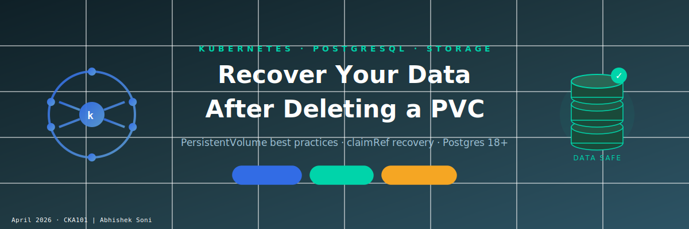

    



> **A real-world survival guide with best practices for PersistentVolume and PersistentVolumeClaim management in Kubernetes.**  
  
---  
  
## Table of Contents  
  
1. [The Scenario — What Went Wrong](#1-the-scenario--what-went-wrong)  
2. [Understanding PV, PVC and the Lifecycle](#2-understanding-pv-pvc-and-the-lifecycle)  
3. [Best Practices When Declaring PV and PVC](#3-best-practices-when-declaring-pv-and-pvc)  
4. [Setting Up — Full Working Manifests](#4-setting-up--full-working-manifests)  
5. [Creating a Database in PostgreSQL](#5-creating-a-database-in-postgresql)  
6. [Simulating the Accident — Deleting Deployment and PVC](#6-simulating-the-accident--deleting-deployment-and-pvc)  
7. [Recovering the Data](#7-recovering-the-data)  
8. [Verifying the Data is Back](#8-verifying-the-data-is-back)  
9. [Summary Cheat Sheet](#9-summary-cheat-sheet)  
  
---  
  
## 1. The Scenario — What Went Wrong  
  
You have a PostgreSQL pod running in Kubernetes, backed by a PersistentVolume. One day you (or a teammate) accidentally run:  
  
```bash  
kubectl delete deployment db-deployment -n cka
kubectl delete pvc db-pvc -n cka
```  
  
💥 The pod is gone. The PVC is gone. Your database seems lost.  
  
**But is it really?**  
  
Not necessarily — if you set up your PersistentVolume with the right `reclaimPolicy`, your data is still sitting safely on disk. This guide shows you exactly how to get it back, and more importantly, how to set things up correctly so you never truly lose data again.  
  
---  
  
## 2. Understanding PV, PVC and the Lifecycle  
  
### PersistentVolume (PV)  
A PV is a piece of storage provisioned in the cluster. It exists independently of any pod or deployment. Think of it as a physical hard drive.  
  
### PersistentVolumeClaim (PVC)  
A PVC is a *request* for storage by a user. It binds to a PV. Think of it as plugging a cable into that hard drive.  
  
### The Binding Lifecycle  
  

  
### Reclaim Policies — The Critical Setting  
  
| Policy | What happens when PVC is deleted |  
|--------|----------------------------------|  
| `Retain` | PV survives, `data is safe` — manual cleanup required |  
| `Delete` | PV and underlying storage are deleted automatically |  
| `Recycle` | Deprecated — basic scrub, makes PV available again |  
  
>  **Golden Rule:** Always use `Retain` for production or important data.  
  
---  
  
## 3. Best Practices When Declaring PV and PVC  
  
###  DO: Use `Retain` Reclaim Policy  
  
```yaml  
persistentVolumeReclaimPolicy: Retain  
```  
  
###  DO: Pin the PVC to a specific PV using `volumeName`  
  
Without this, Kubernetes will bind your PVC to any available matching PV — including dynamically provisioned ones you didn't intend. Always be explicit:  
  
```yaml  
spec:  
 volumeName: db-pv   # ← Force bind to your specific PV  
```  
  
###  DO: Use explicit `hostPath.type`  
  
```yaml  
hostPath:  
 path: "/data/db" 
 type: DirectoryOrCreate  
```  
  
###  DO: Match `storageClassName` exactly between PV and PVC  
  
```yaml  
# Both PV and PVC must have:  
storageClassName: standard  
```  
  
###  DO: Pin your image tag — never use `latest` for stateful workloads  
  
```yaml  
image: postgres:18   #  Pinned # image: postgres:latest is Dangerous — can pull a breaking major version  
```  
  
###  DON'T: Mount at `/var/lib/postgresql/data` with Postgres 18+  
  
Postgres 18+ changed its data directory layout. The volume must be mounted at the **parent** directory:  
  
```yaml  
#  Broken for Postgres 18+mountPath: /var/lib/postgresql/data  
  
#  Correct for Postgres 18+mountPath: /var/lib/postgresql  
```  
  
---  
  
## 4. Setting Up — Full Working Manifests  
  
### `db-volumes.yaml`  
  
```yaml  
kind: PersistentVolume  
apiVersion: v1  
metadata:  
 name: db-pv
spec:  
capacity: 
    storage: 1Gi 
accessModes: 
 - ReadWriteOnce
persistentVolumeReclaimPolicy: Retain          # Data survives PVC deletion 
storageClassName: standard 
hostPath: 
    path: "/mnt/c/CKA" 
    type: DirectoryOrCreate
---  
apiVersion: v1  
kind: PersistentVolumeClaim  
metadata:  
  name: db-pvc 
  namespace: cka
spec:  
  accessModes: 
   - ReadWriteOnce
  resources:
   requests:
    storage: 1Gi
  storageClassName: standard
  volumeName: db-pv                              #  Bind explicitly to our PV  
```  
  
### `db-deployment.yaml`  
  
```yaml  
apiVersion: apps/v1
kind: Deployment
metadata:
  name: db-deployment
  namespace: cka
spec:
  replicas: 1
  selector:
    matchLabels:
      app: db
  template:
    metadata:
      labels:
        app: db
    spec:
      containers:
      - name: postgres
        image: postgres:18              #  Pinned image tag
        env:
        - name: POSTGRES_USER
          value: admin
        - name: POSTGRES_PASSWORD
          value: password
        - name: POSTGRES_DB
          value: mydatabase
        ports:
        - containerPort: 5432
        volumeMounts:
        - name: db-storage
          mountPath: /var/lib/postgresql          # Parent path for Postgres 18+ 
      volumes:
      - name: db-storage
        persistentVolumeClaim:
          claimName: db-pvc  
```  
  
Apply both:  
  
```bash  
kubectl apply -f db-volumes.yamlkubectl apply -f db-deployment.yaml
```  
  
Verify the PVC binds to **your** PV (not a dynamically provisioned one):  
  
```bash  
kubectl get pvc,pv -n cka
```  
  
Expected output:  
  
```  
NAME      STATUS   VOLUME   CAPACITY   STORAGECLASS  
db-pvc    Bound    db-pv    1Gi        standard  
  
NAME    RECLAIM POLICY   STATUS   CLAIM  
db-pv   Retain           Bound    cka/db-pvc  
```  
  
---  
  
## 5. Creating a Database in PostgreSQL  
  
Once your pod is running, create additional databases using `psql`.  
  
### Step 1 — Verify pod is running  
  
```bash  
kubectl get pods -n cka -l app=db  
```  
  
### Step 2 — Open an interactive psql shell  
  
```bash  
kubectl exec -it deploy/db-deployment -n cka -- psql -U admin -d mydatabase -W
```  
  
You'll be prompted for the password (`password`).  
  
### Step 3 — Create a new database  
  
```sql  
CREATE DATABASE db1;  
```  
  
### Step 4 — List all databases to confirm  
  
```sql  
\l  
```  
  
Output:  
  
```  
 Name     |  Owner------------+---------  
 db1        | admin ✅ newly created 
 mydatabase | admin ✅ auto-created at init postgres   | postgres
```  
  
### Step 5 — Exit psql  
  
```sql  
\q  
```  
  
### One-liner (non-interactive)  
  
```bash  
kubectl exec deploy/db-deployment -n cka -- psql -U admin -d mydatabase -c "CREATE DATABASE db1;"
```  
  
---  
  
## 6. Simulating the Accident — Deleting Deployment and PVC  
  
```bash  
kubectl delete deployment db-deployment -n ckakubectl delete pvc db-pvc -n cka
```  
  
Now check the PV:  
  
```bash  
kubectl get pv
```  
  
```  
NAME    CAPACITY   RECLAIM POLICY   STATUS     CLAIM  
db-pv   1Gi        Retain           Released   cka/db-pvc  
```  
  
- Status is `Released` — **not deleted**   
- Data is still on disk at `/mnt/c/CKA`   
- But it cannot be claimed by a new PVC yet ⚠️  
  
---  
  
## 7. Recovering the Data  
  
The PV has a stale `claimRef` pointing to the deleted PVC. Clear it first.  
  
### Step 1 — Remove the stale claimRef  
  
You have two options — use whichever you prefer:  
  
**Option A — Patch (one-liner, scriptable):**  
  
```bash  
kubectl patch pv db-pv --type=json -p='[{"op": "remove", "path": "/spec/claimRef"}]'  
```  
  
**Option B — Manual edit (interactive, great for learning):**  
  
```bash  
kubectl edit pv db-pv
```  
  
This opens the PV manifest in your default editor. Find and **delete** the entire `claimRef` block:  
  
```yaml  
# DELETE these lines:  
 claimRef: 
   apiVersion: v1
   kind: PersistentVolumeClaim 
   name: db-pvc 
   namespace: cka 
   resourceVersion: "12345" 
   uid: d91938f6-66cf-4c0a-b55f-f501e4d5bcfb  
```  
  
Save and close the editor. Kubernetes will immediately update the PV.  
  
> 💡 **Tip:** The `claimRef` block appears under `spec:` in the manifest. Delete all lines from `claimRef:` down to (and including) the `uid:` line.  
  
### Step 2 — Verify PV is `Available`  
  
```bash  
kubectl get pv db-pv
```  
  
```  
NAME    CAPACITY   RECLAIM POLICY   STATUS      CLAIM  
db-pv   1Gi        Retain           Available  
```  
  
### Step 3 — Re-apply PVC and Deployment  
  
```bash  
kubectl apply -f db-volumes.yamlkubectl apply -f db-deployment.yaml
```  
  
### Step 4 — Watch the rollout  
  
```bash  
kubectl -n cka rollout status deployment/db-deployment
```  
  
---  
  
## 8. Verifying the Data is Back  
  
Connect to Postgres and confirm your databases survived:  
  
```bash  
kubectl exec -it deploy/db-deployment -n cka -- psql -U admin -d mydatabase -W
```  
  
Inside psql:  
  
```sql  
\l  
```  
  
```  
 Name     |  Owner------------+---------  
 db1        | admin ✅ Still here! 
 mydatabase | admin ✅ Still here!
 ```  
  
Switch to a specific database and check tables:  
  
```sql  
\c db1  
\dt  
SELECT * FROM your_table;  
\q  
```  
  
---  
  
## 9. Summary Cheat Sheet  
  
### Setup Best Practices  
  
| # | Practice | Detail |  
|---|----------|--------|  
| ✅ | `reclaimPolicy: Retain` on PV | Data survives PVC deletion |  
| ✅ | `volumeName: <pv-name>` in PVC | Prevents binding to wrong dynamic PV |  
| ✅ | Pin image tag (`postgres:18`) | Avoid breaking changes from `latest` |  
| ✅ | Mount at `/var/lib/postgresql` | Required for Postgres 18+ layout |  
  
### When Accident Happens  
  
| PV Status after PVC deleted | Data Safe? |  
|-----------------------------|------------|  
| `Released` |  Yes — PV still exists, recover using steps below |  
| `Deleted` | ❌ No — underlying storage was wiped |  
  
### Recovery Steps  
  
| Step | Command |  
|------|---------|  
| 1. Remove stale claimRef (patch) | `kubectl patch pv db-pv --type=json -p='[{"op":"remove","path":"/spec/claimRef"}]'` |  
| 1. Remove stale claimRef (edit) | `kubectl edit pv db-pv` → delete the `claimRef:` block |  
| 2. Verify PV is Available | `kubectl get pv db-pv` |  
| 3. Re-apply volumes | `kubectl apply -f db-volumes.yaml` |  
| 4. Re-apply deployment | `kubectl apply -f db-deployment.yaml` |  
| 5. Verify correct binding | `kubectl get pvc,pv -n cka` → db-pvc must show VOLUME = db-pv |  
  
### PostgreSQL Quick Commands  
  
| Action | Command |  
|--------|---------|  
| Connect (interactive) | `kubectl exec -it deploy/db-deployment -n cka -- psql -U admin -d mydatabase -W` |  
| Create database | `CREATE DATABASE db1;` |  
| List all databases | `\l` |  
| Switch database | `\c db1` |  
| List tables | `\dt` |  
| Exit psql | `\q` |  
  
---  
  
*Written based on a real Kubernetes lab session using Minikube on Windows/WSL with PostgreSQL 18. All manifests tested and verified.*